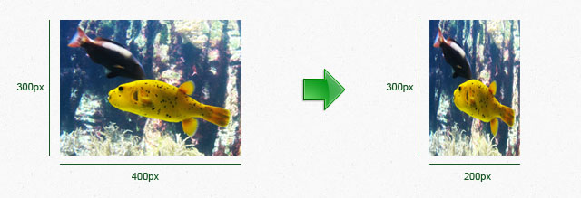
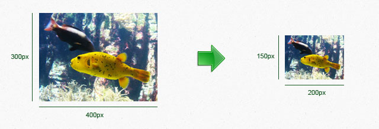
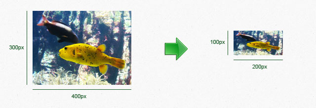
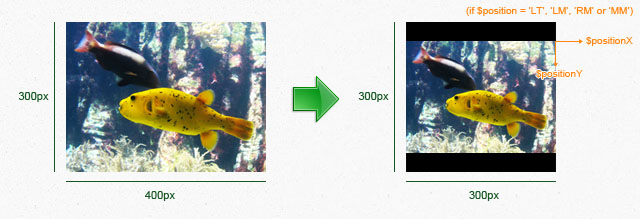
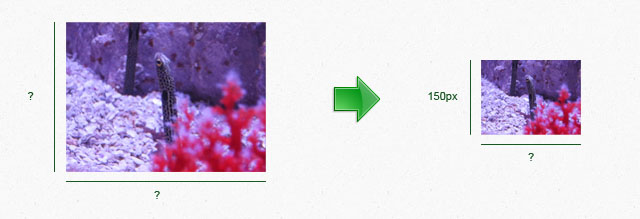

# ImageWorkshop

## Resizing

Read the tutorial "[Creating thumbnails](../tutorials/creating-thumbnails.md)" to see some examples.

### 1. Classical resizing

If you choose the resize both sides (width and height) of a layer, and also to conserve proportion, it will result to place the layer in a new transparent box !
You can choose the placement of the layer in this box thanks to `$positionX`, `$positionY` and `$position` parameters: see the Corners / positions schema of an image.
Otherwise, you can ignore these 3 parameters (just don't use them) !

Classical resize in pixel:

```php
$thumbWidth = 125; // px
$thumbHeight = null;
$conserveProportion = true;
$positionX = 0; // px
$positionY = 0; // px
$position = 'MM';

$layer->resizeInPixel($thumbWidth, $thumbHeight, $conserveProportion, $positionX, $positionY, $position);
```

In percent:

```php
$thumbWidth = 125; // px
$thumbHeight = null;
$conserveProportion = true;
$positionX = 0; // px
$positionY = 0; // px
$position = 'MM';

$layer->resizeInPercent($thumbWidth, $thumbHeight, $conserveProportion, $positionX, $positionY, $position);
```

Lets see all the possibilities (four) to apply with on a layer:

#### 1st possibility: resize WITHOUT proportion based on just ONE side:

I choose to resize the width of my layer without conserving initial proportion:

```php
$layer->resizeInPixel(200, null, false); // We can ignore the other params ($positionX, $positionY, $position)
```

Here the result:



#### 2nd possibility: resize WITH proportion based just on ONE side:

I choose to resize the width of my layer but also to conserve proportion:

```php
$layer->resizeInPixel(200, null, true); // We can ignore the other params ($positionX, $positionY, $position)
```

Here the result:



#### 3rd possibility: resize WITHOUT proportion AND based on BOTH sides:

I choose to resize the width and the height of my layer, and without conserving proportion:

```php
$layer->resizeInPixel(200, 100, false); // We can ignore the other params ($positionX, $positionY, $position)
```

Here the result:



#### 4th possibility: resize WITH proportion AND based on BOTH sides (since 1.2 version):

I choose to resize the width and the height of my layer, but also to conserve proportion, and to place the layer in the middle of the new box:

```php
$layer->resizeInPixel(300, 300, true, 0, 0, 'MM'); // $positionX, $positionY & $position will have an impact on the layer position in the new box of 300px/300px (try another one !)
```

Consider also that the new borders are transparent but imagine I chose to add black background to my layer for the illustration needs...

Here the result:



### 2. Resizing based on the narrow side

 The resize will be based on the narrow side of the layer.

In pixel:

```php
$newNarrowSideWidth = 125; // px
$conserveProportion = true;

$layer->resizeByNarrowSideInPixel($newNarrowSideWidth, $conserveProportion);
```

In percent:

```php
$newNarrowSideWidth = 110; // %
$conserveProportion = true;

$layer->resizeByNarrowSideInPercent($newNarrowSideWidth, $conserveProportion);
```

There are two cases to apply with:

#### 1st possibility: resize WITHOUT proportion:

I choose to resize only the narrow side:

```php
$layer->resizeByNarrowSideInPercent(150, false);
```

Here the result:


#### 2nd possibility: resize WITH proportion:

I choose to conserve proportion:

```php
$layer->resizeByNarrowSideInPercent(150, true);
```

Here the result:



### 3. Resizing based on the largest side

The resize will be based on the largest side of the layer.

In pixel:

```php
$newLargestSideWidth = 125; // px
$conserveProportion = true;

$layer->resizeByLargestSideInPixel($newLargestSideWidth, $conserveProportion);
```

In percent:

```php
$newLargestSideWidth = 110; // %
$conserveProportion = true;

$layer->resizeByLargestSideInPercent($newLargestSideWidth, $conserveProportion);
```

There are two cases to apply with:

#### 1st possibility: resize WITHOUT proportion:

I choose to resize only the largest side:

```php
$layer->resizeByLargestSideInPercent(150, false);
```

Here the result:


#### 2nd possibility: resize WITH proportion:

I choose to conserve proportion:

```php
$layer->resizeByLargestSideInPercent(150, true);
```

Here the result:


[<< Opacity](opacity.md) - [Rotating >>](rotating.md)
