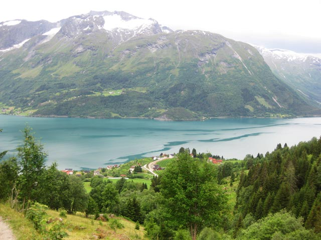
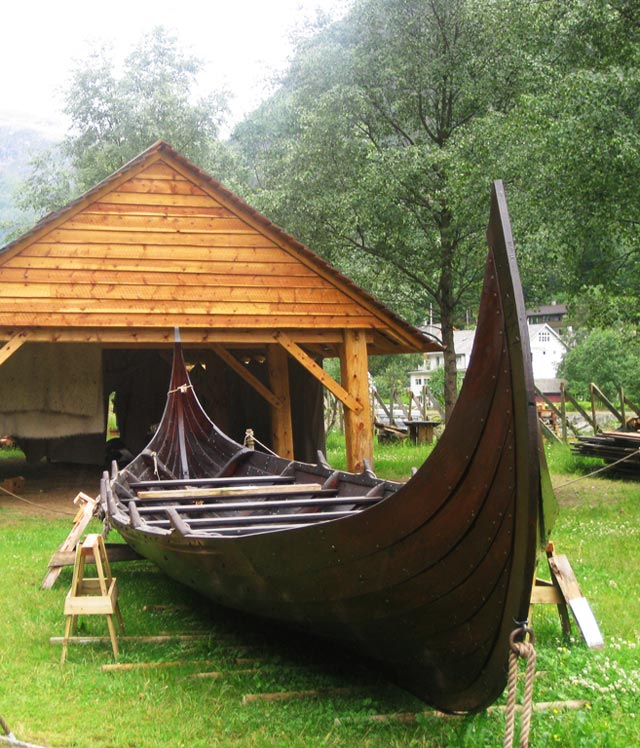

# ImageWorkshop

## Creating thumbnails

### The purpose of the tutorial

There are many ways to generate a thumbnail thanks to [resize](TODO) and [crop](TODO) methods...
We will see 3 cases particularly that could be used.

We suppose in these methods that we want to generate thumbnails with fixed width and height, which is usually the case.

### 1. Conserving all the image

In this case, we want to conserve all the image, and not to crop a part of it.

We have to used the [4th possibility of use](TODO) of `resizeInPixel()` (or Percent) method:

```php
// Resize to get the thumbnail
$layer->resizeInPixel(200, 120, true, 0, 0, 'MM');
```

We force the image to be resized in a box of 200px / 120px.

Here an example with a picture of 640px / 480px:



And the result:


I chose black background in this example to fill the box (but you can choose a transparent fill if your image is saved as a PNG, or another colour...).

Let's see with a picture having a largest height than the width (640px / 748px):



And the result:


Images are totally conserved, and we get thumbnails having the expected width and height.

### 2. Get squared thumbnails not in a box

What if we want to generate squared thumbnails ?

We can use the previous method, but for a matter of aesthetics, we don't want to have to place our images in black, or transparent (etc...) boxes... like this:


So we will have to use a cropping method. In a first time, we will get a square of the maximum possible of the image:

```php
// Get a square ("MM" to say in the middle of the layer) of the maximum possible
$layer->cropMaximumInPixel(0, 0, "MM");
```

If we save the layer at this step, here what we get (a squared image):


And now we will use a resize method to get a thumbnail of 200px / 200px:

```php
// Resize the squared layer in smaller sizes
$layer->resizeInPixel(200, 200);
```

The result:


All the code of this method:

```php
$layer->cropMaximumInPixel(0, 0, "MM");
$layer->resizeInPixel(200, 200);
```

### 3. Get a portrait (or landscape) format not in a box:

Finally, we decide to have thumbnails with conserved proportions not placed in a box... and not squared: this is the last case.

To perform this, we have to generate a squared layer (previous case) having the largest side of the expected thumbnail, and then to crop it. By doing this, we are sure to conserve proportion (no flattening) and to don't have to fill new edges.

```php
$expectedWidth = 200;
$expectedHeight = 120;

// Determine the largest expected side automatically
($expectedWidth > $expectedHeight) ? $largestSide = $expectedWidth : $largestSide = $expectedHeight;

// Get a squared layer
$layer->cropMaximumInPixel(0, 0, "MM");

// Resize the squared layer with the largest side of the expected thumb
$layer->resizeInPixel($largestSide, $largestSide);

// Crop the layer to get the expected dimensions
$layer->cropInPixel($expectedWidth, $expectedHeight, 0, 0, 'MM');
````

Here the result:


You can now choose your favorite method to generate thumbnails !
